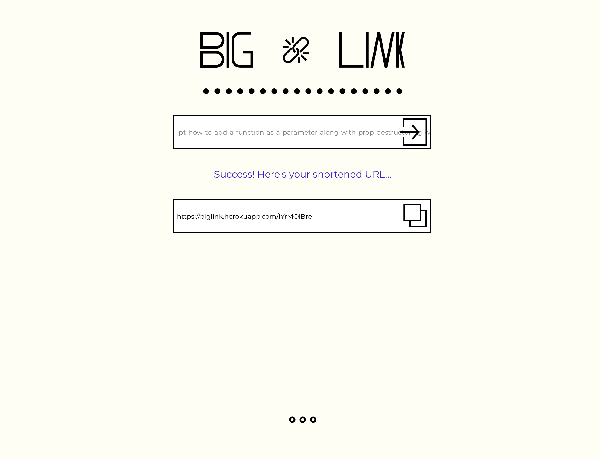

# Big Link

A simple URL shortener that uses Express and MongoDB to store and redirect urls.

The frontend is supported by React and uses styled components (Emotion).

## Try it out [here](https://biglink.herokuapp.com)!

